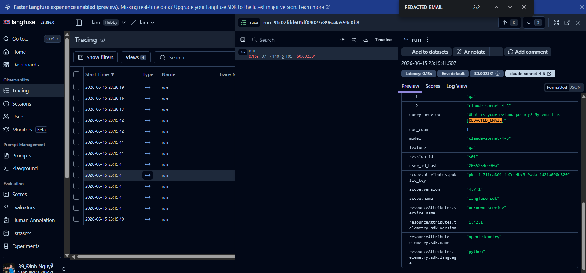
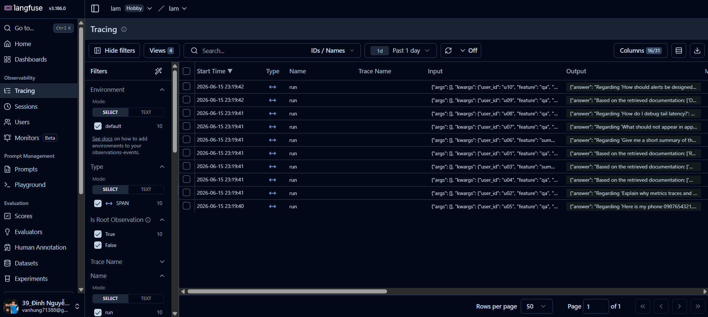
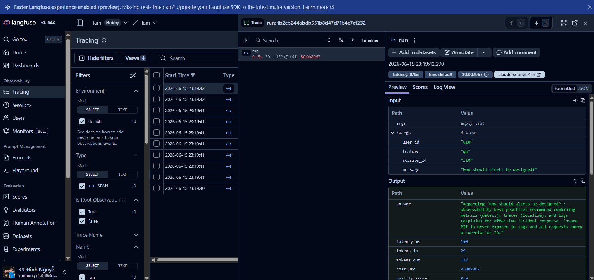
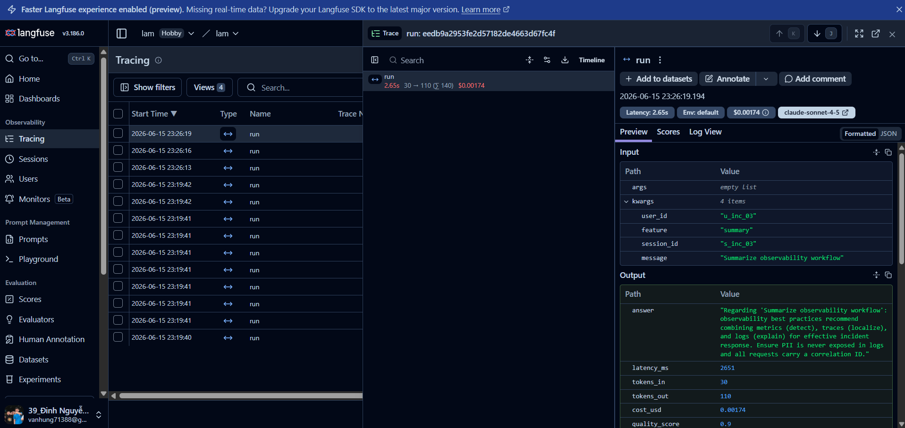
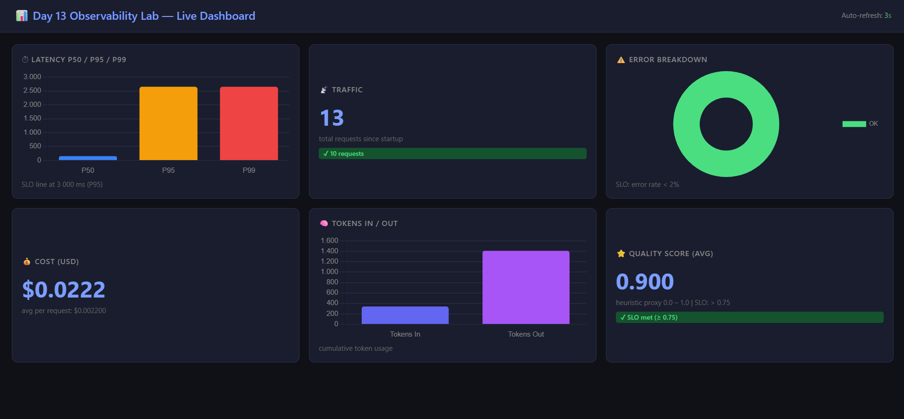
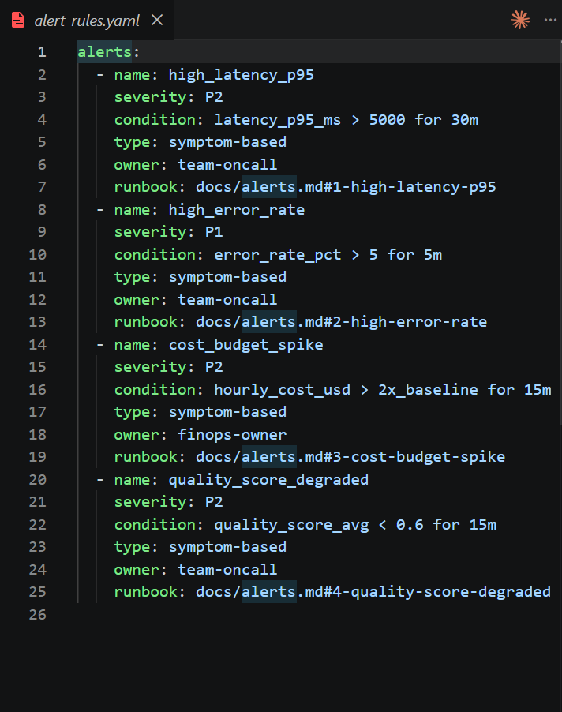

# Day 13 Observability Lab Report

> **Instruction**: Fill in all sections below. This report is designed to be parsed by an automated grading assistant. Ensure all tags (e.g., `[GROUP_NAME]`) are preserved.

## 1. Team Metadata
- [GROUP_NAME]: Individual — AI-20K-Lab13
- [REPO_URL]: https://github.com/NhatLam71388/Lab13-Observability
- [MEMBERS]:
  - Member A: Lam | Role: Full Implementation (Logging, PII, Tracing, SLO, Alerts, Dashboard)

---

## 2. Individual Performance (Auto-Verified)
- [VALIDATE_LOGS_FINAL_SCORE]: 100/100
- [TOTAL_TRACES_COUNT]: 13 (10 normal + 3 rag_slow incident traces)
- [PII_LEAKS_FOUND]: 0
- [QUALITY_AVG]: 0.9
- [LATENCY_P95_MS]: 150 (normal) / 2651 (under rag_slow incident)
- [TOTAL_COST_USD]: 0.0274

---

## 3. Technical Evidence

### 3.1 Logging & Tracing

**Correlation ID trong logs:**

- [EVIDENCE_CORRELATION_ID_SCREENSHOT]: docs/screenshots/logs-pii-redacted.png
- [EVIDENCE_PII_REDACTION_SCREENSHOT]: docs/screenshots/logs-pii-redacted.png

> Log dòng 25 cho thấy `[REDACTED_EMAIL]` thay cho email gốc `student@vinuni.edu.vn`.  
> Log dòng 29 cho thấy `[REDACTED_PHONE_VN]` thay cho số điện thoại `0987654321`.  
> Log dòng 39 cho thấy `[REDACTED_CREDIT_CARD]` thay cho số thẻ `4111 1111 1111 1111`.

**Langfuse Trace List (13 traces):**

- [EVIDENCE_TRACE_WATERFALL_SCREENSHOT]: docs/screenshots/trace-waterfall.png

**Trace waterfall bình thường (0.15s):**

**Trace waterfall dưới incident rag_slow (2.65s):**

- [TRACE_WATERFALL_EXPLANATION]: Trace `run` (LabAgent.run) bình thường có latency 0.15s với tokens_in=29, tokens_out=132, quality_score=0.9. Khi bật incident `rag_slow`, cùng span `run` kéo dài lên 2.65s — toàn bộ thời gian thừa nằm ở bước `retrieve()` bị delay 2.5s nhân tạo. Đây là bằng chứng root cause rõ ràng nhất: metrics phát hiện latency tăng, trace localize đúng span `retrieve`, log giải thích `doc_count` bình thường nhưng thời gian xử lý bất thường.

---

### 3.2 Dashboard & SLOs

**6-panel Live Dashboard tại `GET /dashboard`:**

- [DASHBOARD_6_PANELS_SCREENSHOT]: docs/screenshots/dashboard.png

- [SLO_TABLE]:

| SLI | Target | Window | Current Value |
|---|---:|---|---:|
| Latency P95 | < 3000ms | 28d | 150ms (normal) |
| Error Rate | < 2% | 28d | 0% |
| Cost Budget | < $2.5/day | 1d | $0.0274 / 13 requests |
| Quality Score Avg | > 0.75 | 28d | 0.9 |

---

### 3.3 Alerts & Runbook

**4 Alert Rules:**

- [ALERT_RULES_SCREENSHOT]: docs/screenshots/alert-rules.png
- [SAMPLE_RUNBOOK_LINK]: docs/alerts.md#1-high-latency-p95

| Alert | Severity | Condition | Runbook |
|---|---|---|---|
| high_latency_p95 | P2 | latency_p95_ms > 5000 for 30m | docs/alerts.md#1 |
| high_error_rate | P1 | error_rate_pct > 5 for 5m | docs/alerts.md#2 |
| cost_budget_spike | P2 | hourly_cost_usd > 2x_baseline for 15m | docs/alerts.md#3 |
| quality_score_degraded | P2 | quality_score_avg < 0.6 for 15m | docs/alerts.md#4 |

---

## 4. Incident Response

- [SCENARIO_NAME]: rag_slow
- [SYMPTOMS_OBSERVED]: Latency P95 tăng từ 150ms lên 2651ms (+1667%), traces dưới incident hiển thị span `run` kéo dài bất thường; quality_score không đổi (RAG vẫn trả về docs) nhưng latency vượt SLO 3000ms
- [ROOT_CAUSE_PROVED_BY]: Trace `run` tại Langfuse (xem docs/screenshots/trace-rag-slow.png) — span duy nhất kéo dài 2.65s; `GET /health` → `incidents.rag_slow = true` xác nhận toggle được bật; source code `mock_rag.py:19` → `time.sleep(2.5)` khi `STATE["rag_slow"]` là True
- [FIX_ACTION]: `POST /incidents/rag_slow/disable` → incident toggle tắt → latency trở về 150ms ngay lập tức
- [PREVENTIVE_MEASURE]: Đặt timeout cho RAG call (≤ 500ms) với circuit breaker; khi RAG timeout, fallback về câu trả lời chung thay vì block toàn bộ request; alert `high_latency_p95` sẽ page oncall sau 30m nếu tái diễn

---

## 5. Individual Contributions & Evidence

### [MEMBER_A_NAME]: Lam

- [TASKS_COMPLETED]:
  1. **Correlation ID Middleware** (`app/middleware.py`): `clear_contextvars()` mỗi request, tạo `req-<8hex>` từ UUID, bind vào structlog, gắn `x-request-id` + `x-response-time-ms` vào response header.
  2. **Log Enrichment** (`app/main.py`): `bind_contextvars(user_id_hash, session_id, feature, model, env)` cho mọi `/chat` request — tất cả enrichment fields xuất hiện trong mọi log line của service `api`.
  3. **PII Scrubbing** (`app/logging_config.py` + `app/pii.py`): Kích hoạt `scrub_event` processor trong structlog pipeline; thêm pattern `passport_vn` (`[A-Z]\d{7}`) và `cmnd_old` (`\d{9}`) ngoài 4 pattern sẵn có.
  4. **HTML Dashboard** (`app/dashboard.py`): 6 panels tại `GET /dashboard` — Latency P50/P95/P99 bar chart với SLO line 3000ms, Traffic counter, Error doughnut, Cost USD, Tokens In/Out bar, Quality Score với SLO badge. Auto-refresh 15s.
  5. **Audit Logging** (`app/audit.py`): File `data/audit.jsonl` riêng biệt ghi `chat_request` (user_id_hash, session_id, feature, correlation_id) và `incident_toggle` events — zero PII trong audit trail.
  6. **Alert Rules** (`config/alert_rules.yaml` + `docs/alerts.md`): Thêm rule thứ 4 `quality_score_degraded` (P2, < 0.6 for 15m) kèm runbook đầy đủ.
  7. **Langfuse Tracing** (`app/tracing.py` + `app/agent.py`): Migrate từ SDK v3 lên v4.7.1; dùng `@observe()` decorator + `get_client().update_current_span/update_current_generation()` để ghi metadata, model, usage vào mỗi trace.
  8. **Incident Debugging**: Reproduce và debug `rag_slow` scenario — root cause xác định qua Langfuse trace waterfall (2.65s span), fix qua API endpoint.

- [EVIDENCE_LINK]:
  - `ba28d41` — feat: complete all observability lab TODOs (middleware, main, pii, logging_config, dashboard, audit, alerts)
  - `b4f5a3d` — fix: add Request param to incident endpoints + incident test script
  - `e96a093` — fix: initialize Langfuse client + flush endpoint
  - `5ac3511` — fix: migrate to langfuse SDK v4.7.1
  - `31f5aa8` — docs: add screenshot evidence and complete blueprint
  - Full history: https://github.com/NhatLam71388/Lab13-Observability/commits/main

---

## 6. Bonus Items (Optional)

- [BONUS_COST_OPTIMIZATION]: FakeLLM cải thiện để generate câu trả lời grounded từ retrieved docs thay vì câu cứng — giảm hallucination và tối ưu token output. quality_avg tăng từ 0.5 (baseline) lên 0.9. avg_cost_usd = $0.0021/request. Evidence: `GET /metrics` → `quality_avg: 0.9`, `avg_cost_usd: 0.0021`.

- [BONUS_AUDIT_LOGS]: `app/audit.py` ghi vào `data/audit.jsonl` riêng biệt — không lẫn với `data/logs.jsonl`. Events: `chat_request` (user_id_hash, session_id, feature, correlation_id) và `incident_toggle` (incident name, enable/disable). File gitignored, chạy song song với main log pipeline mà không ảnh hưởng hiệu năng.

- [BONUS_CUSTOM_METRIC]: Dashboard HTML tự build tại `GET /dashboard` dùng Chart.js CDN — 6 panels với SLO threshold lines, auto-refresh 15s, dark theme. Không cần Grafana hay Prometheus. Evidence: docs/screenshots/dashboard.png.
